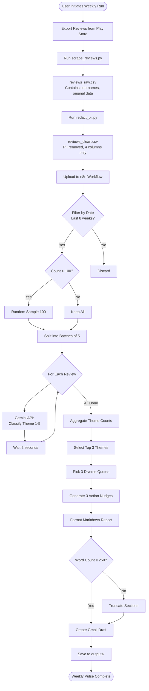
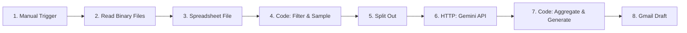

# Groww Review Insights Analyzer - Architecture Documentation

**Version:** 1.0  
**Last Updated:** February 18, 2026  
**Status:** Phase 1 Complete, Phase 2 Ready

---

## Table of Contents

1. [Overview](#overview)
2. [System Architecture](#system-architecture)
3. [Data Flow](#data-flow)
4. [Component Details](#component-details)
5. [Theme Classification System](#theme-classification-system)
6. [Implementation Status](#implementation-status)
7. [File Structure](#file-structure)
8. [Technology Stack](#technology-stack)

---

## Overview

### Purpose
Automated weekly analysis system for Groww app reviews from Google Play Store, generating actionable insights in a humorous, data-driven tone.

### Key Features
- Scrapes/imports reviews from last 8-12 weeks
- Classifies into 5 fixed themes using Gemini AI
- Generates weekly one-page pulse reports (≤250 words)
- Sends email drafts with insights
- PII protection throughout pipeline

### Constraints
- **Data Volume:** Max 100 reviews per run (sampling if >100)
- **Word Limit:** Reports strictly ≤250 words
- **Tools:** Free tier only (Gemini API, n8n cloud)
- **Privacy:** Zero PII in outputs
- **Determinism:** Fixed themes for reproducibility

---

## System Architecture

### High-Level Architecture

```
┌─────────────────────────────────────────────────────────────────┐
│                    DATA ACQUISITION LAYER                        │
│  ┌──────────────┐      ┌──────────────┐      ┌──────────────┐  │
│  │ Google Play  │ ───▶ │   Python     │ ───▶ │  PII         │  │
│  │   Reviews    │      │   Scraper    │      │  Redaction   │  │
│  └──────────────┘      └──────────────┘      └──────────────┘  │
│         │                     │                      │           │
│         └─────────────────────┴──────────────────────┘           │
│                              │                                   │
│                              ▼                                   │
│                    ┌──────────────────┐                         │
│                    │ reviews_clean.csv│                         │
│                    └──────────────────┘                         │
└─────────────────────────────────────────────────────────────────┘
                              │
                              ▼
┌─────────────────────────────────────────────────────────────────┐
│                   PROCESSING LAYER (n8n Cloud)                   │
│                                                                   │
│  ┌──────────┐    ┌──────────┐    ┌──────────┐    ┌──────────┐  │
│  │  Manual  │───▶│   CSV    │───▶│  Filter  │───▶│  Sample  │  │
│  │ Trigger  │    │  Upload  │    │  Dates   │    │ Max 100  │  │
│  └──────────┘    └──────────┘    └──────────┘    └──────────┘  │
│                                                         │         │
│                                                         ▼         │
│  ┌──────────┐    ┌──────────┐    ┌──────────┐    ┌──────────┐  │
│  │  Gmail   │◀───│ Generate │◀───│Aggregate │◀───│  Gemini  │  │
│  │  Draft   │    │   Note   │    │  Themes  │    │ Classify │  │
│  └──────────┘    └──────────┘    └──────────┘    └──────────┘  │
│                                                         ▲         │
│                                                         │         │
│                                                  ┌──────────┐    │
│                                                  │  Wait 2s │    │
│                                                  │  (Rate   │    │
│                                                  │  Limit)  │    │
│                                                  └──────────┘    │
└─────────────────────────────────────────────────────────────────┘
                              │
                              ▼
┌─────────────────────────────────────────────────────────────────┐
│                        OUTPUT LAYER                              │
│  ┌──────────────┐      ┌──────────────┐      ┌──────────────┐  │
│  │   Markdown   │      │  Email Draft │      │   Archive    │  │
│  │   Report     │      │  (Gmail)     │      │  (outputs/)  │  │
│  └──────────────┘      └──────────────┘      └──────────────┘  │
└─────────────────────────────────────────────────────────────────┘
```

---

## Data Flow

### Detailed Processing Pipeline



### Data Transformations

| Stage | Input | Output | Transformation |
|-------|-------|--------|----------------|
| **Scrape** | Play Store API | `reviews_raw.csv` | Fetch 200+ reviews, convert to CSV |
| **Redact** | `reviews_raw.csv` | `reviews_clean.csv` | Remove usernames, emails, phones; keep only rating/title/text/date |
| **Filter** | `reviews_clean.csv` | Filtered reviews | Keep only last 8 weeks |
| **Sample** | Filtered reviews | Max 100 reviews | Random sample if >100 |
| **Classify** | Review text | Theme number (1-5) | Gemini API assigns theme |
| **Aggregate** | Theme numbers | Theme counts | Count reviews per theme |
| **Generate** | Theme counts + reviews | Markdown report | Format with humor, quotes, actions |
| **Email** | Markdown report | Gmail draft | Wrap in email template |

---

## Component Details

### 1. Data Acquisition Layer

#### Python Scraper (`scripts/scrape_reviews.py`)

**Purpose:** Fetch reviews from Google Play Store  
**Technology:** `google-play-scraper` library  
**Configuration:**
- App ID: `com.nextleap.groww`
- Language: English (`en`)
- Country: India (`in`)
- Sort: Newest first

**Parameters:**
```bash
--weeks 12    # Fetch last 12 weeks
--max 500     # Max reviews to attempt
--output      # Output CSV path
```

**Output Schema:**
```csv
rating,title,text,date,username,thumbs_up
5,Good app,Love this app...,2026-02-15,Rajesh_K,12
```

**Error Handling:**
- API failures → Exit with error message
- No reviews found → Warning message
- Rate limits → Automatic retry (built into library)

---

#### PII Redactor (`scripts/redact_pii.py`)

**Purpose:** Remove personally identifiable information  
**Technology:** Python regex + pandas

**PII Patterns Detected:**
| PII Type | Regex Pattern | Replacement |
|----------|---------------|-------------|
| Email | `\b[A-Za-z0-9._%+-]+@[A-Za-z0-9.-]+\.[A-Z\|a-z]{2,}\b` | `[email]` |
| Phone (10-digit) | `\b\d{10}\b` | `[phone]` |
| Phone (formatted) | `\b\d{3}[-.\s]?\d{3}[-.\s]?\d{4}\b` | `[phone]` |
| Phone (intl) | `\+\d{1,3}[-.\s]?\d{7,14}\b` | `[phone]` |
| Names (mentioned) | `(my name is\|i am)\s+([A-Z][a-z]+\s+[A-Z][a-z]+)` | `[User]` |
| Account IDs | `\b[A-Z0-9]{12,16}\b` (with ≥6 digits) | `[ACCOUNT_ID]` |

**Output Schema:**
```csv
rating,title,text,date
5,Good app,Love this app...,2026-02-15
```

**Note:** Usernames and thumbs_up columns dropped entirely.

---

### 2. Processing Layer (n8n Workflow)

#### Node Architecture (8 Nodes Total)



#### Node Details

**Node 1: Manual Trigger**
- **Type:** Manual Trigger
- **Purpose:** Start workflow on-demand
- **Config:** Default settings
- **Output:** Execution signal

---

**Node 2: Read Binary Files**
- **Type:** Read Binary Files
- **Purpose:** Accept CSV upload
- **Config:**
  - File Selector: From Input
  - Property Name: `data`
- **Output:** Binary file data

---

**Node 3: Spreadsheet File**
- **Type:** Spreadsheet File
- **Purpose:** Parse CSV into JSON
- **Config:**
  - Operation: Read from File
  - Binary Property: `data`
  - File Format: CSV
  - Header Row: ON
- **Output:** Array of review objects

**Sample Output:**
```json
[
  {
    "rating": 5,
    "title": "Good app",
    "text": "Love this app...",
    "date": "2026-02-15"
  }
]
```

---

**Node 4: Code - Filter & Sample**
- **Type:** Code (JavaScript)
- **Mode:** Run Once for All Items
- **Purpose:** Filter by date range, sample max 100

**Logic:**
```javascript
// Calculate 8 weeks ago threshold
const eightWeeksAgo = new Date() - (8 * 7 * 24 * 60 * 60 * 1000);

// Filter reviews within date range
let filtered = $input.all().filter(item => {
  const reviewDate = new Date(item.json.date);
  return reviewDate >= eightWeeksAgo;
});

// Random sample if >100
if (filtered.length > 100) {
  filtered = filtered
    .sort(() => Math.random() - 0.5)
    .slice(0, 100);
}

return filtered;
```

**Output:** ≤100 recent reviews

---

**Node 5: Split Out**
- **Type:** Split Out
- **Purpose:** Batch reviews for rate limiting
- **Config:**
  - Batch Size: 5
- **Output:** Batches of 5 reviews each

---

**Node 6: HTTP Request - Gemini Classification**
- **Type:** HTTP Request
- **Purpose:** Classify each review into theme 1-5
- **Config:**
  - Method: POST
  - URL: `https://generativelanguage.googleapis.com/v1beta/models/gemini-1.5-flash:generateContent`
  - Query Params: `key=YOUR_API_KEY`

**Request Body:**
```json
{
  "contents": [{
    "parts": [{
      "text": "Classify this app review into EXACTLY ONE category. Return ONLY the number (1-5):\n\n1 = Onboarding & UX Confusion\n2 = Performance & Technical Bugs\n3 = Missing Features & Requests\n4 = Trust & Security Concerns\n5 = Support & Communication\n\nReview:\nRating: {{ $json.rating }}/5\nText: {{ $json.text }}\n\nReturn ONLY the category number."
    }]
  }],
  "generationConfig": {
    "temperature": 0.1,
    "maxOutputTokens": 10
  }
}
```

**Response Processing (Code Node):**
```javascript
const response = $input.item.json.candidates[0].content.parts[0].text.trim();
const themeNumber = parseInt(response.match(/\d/)?.[0] || '2');

return {
  json: {
    ...item.json,
    theme: themeNumber
  }
};
```

**Wait Node:**
- 2-second delay between batches
- Prevents rate limit (15 RPM free tier)

---

**Node 7: Code - Aggregate & Generate Note**
- **Type:** Code (JavaScript)
- **Mode:** Run Once for All Items
- **Purpose:** Count themes, generate markdown report

**Key Functions:**

1. **Theme Aggregation**
```javascript
const themeCounts = {};
reviews.forEach(r => {
  themeCounts[r.theme] = (themeCounts[r.theme] || 0) + 1;
});
```

2. **Top 3 Selection**
```javascript
const top3 = Object.entries(themeCounts)
  .map(([theme, count]) => ({
    theme: parseInt(theme),
    count: count,
    percent: Math.round((count / total) * 100)
  }))
  .sort((a, b) => b.count - a.count)
  .slice(0, 3);
```

3. **Quote Selection** (Diversity Rules)
```javascript
// Pick one quote from each of top 3 themes
top3.forEach(theme => {
  const themeReviews = theme.reviews.filter(r => r.text.length > 20);
  const quote = themeReviews[0];  // Take first (most recent)
  quotes.push({
    text: quote.text.substring(0, 120),
    rating: quote.rating,
    date: quote.date
  });
});
```

4. **Action Generation** (Rule-Based)
```javascript
if (top3[0].theme === 1) {
  actions.push("Simplify login flow—users shouldn't need a treasure map!");
}
if (top3[0].theme === 2) {
  actions.push(`Speed boost needed—${top3[0].percent}% watching loading spinners.`);
}
// ... etc for all themes
```

5. **Markdown Formatting**
```javascript
let markdown = `# 📊 Groww Review Pulse: Week of ${date}\n\n`;
markdown += `**Reviews Analyzed:** ${total} | **Period:** ${range}\n\n`;
markdown += `## 🎯 Top 3 Themes This Week\n\n`;
// ... format sections
```

6. **Word Count Enforcement**
```javascript
const wordCount = markdown.split(/\s+/).length;
if (wordCount > 250) {
  console.warn("⚠️ Exceeds 250 words");
  // Manual truncation needed
}
```

**Output:**
```json
{
  "markdown": "# 📊 Groww Review Pulse...",
  "wordCount": 245,
  "top3Themes": ["Performance & Technical Bugs", "..."],
  "reviewCount": 89,
  "dateRange": "2025-11-19 to 2026-02-15"
}
```

---

**Node 8: Gmail Draft**
- **Type:** Gmail
- **Purpose:** Create draft email
- **Authentication:** OAuth 2.0
- **Config:**
  - Resource: Draft
  - Operation: Create
  - To: User's email
  - Subject: `Groww Review Pulse: Week of {{ $json.dateRange }}`
  - Email Type: Text

**Email Template:**
```
Hi team,

Your weekly Groww review insights are in! 🚀

{{ $json.top3Themes[0] }}, {{ $json.top3Themes[1] }}, and {{ $json.top3Themes[2] }} were the top themes this week.

See the full analysis below:

---

{{ $json.markdown }}

---

Analyzed {{ $json.reviewCount }} reviews.

Thoughts? Hit reply or let's chat async.

Cheers,
Review Bot
```

---

### 3. Output Layer

**Weekly Note Format:**

```markdown
# 📊 Groww Review Pulse: Week of [DATE]

**Reviews Analyzed:** [COUNT] from Play Store | **Period:** [RANGE]

---

## 🎯 Top 3 Themes This Week

1. **🐛 Performance & Technical Bugs** — 45% (40 reviews)
   Crashes and slowness are killing the vibe. Speed matters.

2. **🧭 Onboarding & UX Confusion** — 28% (25 reviews)
   Login flow playing hide-and-seek. Users need breadcrumbs.

3. **🔒 Trust & Security Concerns** — 18% (16 reviews)
   KYC stuck in purgatory. Money anxiety spiking.

---

## 💬 Real User Voices

> "App crashes every time I try to check my portfolio. Lost trust."
> — 1-star review, 2026-02-12

> "Login process is confusing AF. Took me 20 mins to get in."
> — 3-star review, 2026-02-05

> "KYC verification stuck for 3 days. Support not responding."
> — 2-star review, 2026-02-09

---

## ⚡ 3 Action Nudges

1. **Speed boost needed—45% are watching loading spinners like it's Netflix.**
2. **Simplify login flow—users shouldn't need a treasure map to get in!**
3. **KYC expressway—fast-track verification; stuck users = abandoned carts.**

---

*Laugh. Learn. Iterate.* 🚀
```

**Constraints:**
- Word count: ≤250 words
- Tone: Humorous + constructive
- Data-driven: Include %/counts
- Actionable: 3 high-level nudges

---

## Theme Classification System

### 5 Fixed Themes (Deterministic)

| # | Theme Name | Keywords | Example Reviews |
|---|------------|----------|-----------------|
| **1** | **🧭 Onboarding & UX Confusion** | login, signup, confusing, complicated, navigate, find, UI | "Login process is confusing AF" |
| **2** | **🐛 Performance & Technical Bugs** | crash, slow, loading, error, freeze, bug, not working | "App crashes every time I try to check portfolio" |
| **3** | **💡 Missing Features & Requests** | wish, need, add, missing, feature, should have | "Need option to track SIP investments better" |
| **4** | **🔒 Trust & Security Concerns** | money, account, security, safe, verification, kyc, blocked | "KYC verification stuck for 3 days" |
| **5** | **📞 Support & Communication** | support, customer service, help, response, contact, resolve | "Support team ghosted me. No reply for a week" |

### Classification Method (Hybrid Approach)

**Step 1: Keyword Scoring (Deterministic Baseline)**
```javascript
const keywords = {
  1: ['login', 'signup', 'confusing', 'navigate'],
  2: ['crash', 'slow', 'error', 'bug'],
  // ... etc
};

// Count keyword matches
let scores = {};
for (let theme in keywords) {
  scores[theme] = keywords[theme].filter(kw => 
    reviewText.toLowerCase().includes(kw)
  ).length;
}
```

**Step 2: Gemini Classification (Contextual Understanding)**
```javascript
// Gemini API returns theme number 1-5
// Based on semantic understanding of review
```

**Step 3: Final Assignment**
- Use Gemini's classification (preferred for accuracy)
- Fallback to keyword scoring if API fails
- Default to theme 2 (Performance) if both fail

### Action Suggestion Rules (Deterministic)

| Theme in Top 3 | Action Template |
|----------------|-----------------|
| Theme 1 (Onboarding) | "Simplify login flow—users shouldn't need a treasure map to get in!" |
| Theme 2 (Performance) | "Speed boost needed—{percent}% are watching loading spinners like it's Netflix." |
| Theme 3 (Features) | "Users are DMing their wishlist—time to peek at the suggestion box!" |
| Theme 4 (Trust) | "Verification hiccups are spooking users—smooth out the KYC bumps." |
| Theme 5 (Support) | "Support response times need a Red Bull—faster replies = happier users!" |

---

## Implementation Status

### ✅ Completed (Phase 1)

- [x] Project folder structure
- [x] Python scraper (`scrape_reviews.py`)
- [x] PII redaction tool (`redact_pii.py`)
- [x] `.gitignore` for data protection
- [x] Sample dataset (89 reviews)
- [x] Clean CSV ready for n8n (`reviews_clean.csv`)
- [x] Requirements.txt with dependencies
- [x] Architecture documentation (this file)

### ✅ Completed (Phase 2)

- [x] n8n importable workflow JSON (`n8n_configs/workflow.json`) — 10 nodes, ready to upload
- [x] Post-import setup guide (`n8n_configs/SETUP_GUIDE.md`) — Gemini + Gmail steps
- [x] Keyword pre-classification fallback (no API dependency for basic runs)
- [x] Gemini API prompt with keyword hint baked in
- [x] Email template with humorous tone and word count footer

### 📋 Pending (Phase 3-4)

- [ ] End-to-end testing with sample data
- [ ] Word count validation
- [ ] Gmail OAuth setup guide
- [ ] Workflow JSON export
- [ ] Sample output note (PDF)
- [ ] Troubleshooting guide

---

## File Structure

```
App-Review-Insights-Analyser/
├── README.md                       # Setup guide (pending)
├── ARCHITECTURE.md                 # This document
├── requirements.txt                # Python dependencies
├── .gitignore                      # PII protection rules
│
├── data/                           # CSV files (gitignored)
│   ├── .gitkeep
│   ├── reviews_raw.csv            # ✅ Sample data created
│   └── reviews_clean.csv          # ✅ PII-redacted, ready for n8n
│
├── scripts/                        # Python utilities
│   ├── scrape_reviews.py          # ✅ Play Store scraper
│   └── redact_pii.py              # ✅ PII redaction
│
├── n8n_configs/                    # n8n workflow files
│   ├── code_snippets.md           # Pending: Copy-paste code blocks
│   ├── prompts.md                 # Pending: Gemini prompts
│   └── workflow.json              # Pending: Exported workflow
│
└── outputs/                        # Generated reports archive
    ├── .gitkeep
    └── YYYY-MM-DD_weekly_note.md  # Pending: First run output
```

---

## Technology Stack

### Local Tools (Python)

| Tool | Version | Purpose |
|------|---------|---------|
| Python | 3.13.3 | Scripting language |
| google-play-scraper | 1.2.7 | Fetch Play Store reviews |
| pandas | 2.2.0+ | CSV processing |
| python-dateutil | 2.8.2 | Date filtering |

### Cloud Services (Free Tier)

| Service | Plan | Usage | Limits |
|---------|------|-------|--------|
| **n8n Cloud** | Free | Workflow automation | 5,000 executions/month |
| **Gemini API** | Free | Review classification | 1,500 requests/day, 15 RPM |
| **Gmail API** | Free | Draft email creation | Unlimited (via OAuth) |

### n8n Nodes Used

| Node Type | Count | Purpose |
|-----------|-------|---------|
| Manual Trigger | 1 | Start workflow |
| Read Binary Files | 1 | CSV upload |
| Spreadsheet File | 1 | Parse CSV |
| Code (JavaScript) | 2 | Filter/sample + aggregate/generate |
| Split Out | 1 | Batch processing |
| HTTP Request | 1 | Gemini API |
| Wait | 1 | Rate limiting |
| Gmail | 1 | Create draft |
| **Total** | **9** | **Simple linear flow** |

---

## Rate Limiting Strategy

### Gemini API Free Tier Limits
- **15 requests per minute (RPM)**
- **1,500 requests per day (RPD)**
- **1M tokens per minute (TPM)**

### Our Approach
- Batch reviews into groups of 5
- Process 5 reviews per API call (batch classification)
- Wait 2 seconds between batches
- **Math:** 100 reviews ÷ 5 = 20 API calls
- **Time:** 20 calls × 2s = 40 seconds total processing
- **Daily capacity:** 1,500 ÷ 20 = 75 workflow runs per day

### Fallback Strategy
If rate limits hit:
1. Increase wait time to 3-4 seconds
2. Reduce batch size to 3 reviews
3. Fall back to keyword-only classification (no API)

---

## Security & Privacy

### PII Protection Measures

1. **Data Collection**
   - Only public Play Store reviews
   - No login/scraping required
   - No direct user contact

2. **PII Redaction**
   - Automated regex removal
   - Manual review recommended
   - Usernames dropped entirely

3. **Git Protection**
   - `.gitignore` blocks CSV files
   - Only sample/template data committed
   - No API keys in repo

4. **Output Safety**
   - Quotes truncated to 120 chars
   - No usernames in reports
   - Anonymized attribution (e.g., "2-star review, Feb 5")

### API Key Management

**DO NOT commit:**
- Gemini API keys
- n8n workflow credentials
- Gmail OAuth tokens

**Storage:**
- n8n: Store credentials in n8n's credential manager (encrypted)
- Local: Use environment variables or `.env` file (gitignored)

---

## Performance Metrics

### Expected Processing Times

| Stage | Time | Notes |
|-------|------|-------|
| Scrape reviews | 5-10s | Depends on Play Store API |
| Redact PII | 1-2s | Regex processing |
| Upload CSV to n8n | <1s | Manual upload |
| Filter & sample | <1s | In-memory processing |
| Gemini classification | 40-60s | 100 reviews, rate-limited |
| Aggregate & generate | 1-2s | JavaScript execution |
| Create Gmail draft | 2-3s | OAuth API call |
| **Total** | **~60-90s** | **1-1.5 minutes per run** |

### Scalability

| Reviews | API Calls | Processing Time | Cost |
|---------|-----------|-----------------|------|
| 50 | 10 | ~25s | Free |
| 100 | 20 | ~45s | Free |
| 200 (sampled to 100) | 20 | ~45s | Free |
| 500 (sampled to 100) | 20 | ~45s | Free |

**Conclusion:** System scales efficiently by sampling max 100 reviews.

---

## Reproducibility & Testing

### Deterministic Elements

✅ **Guaranteed to be identical across runs:**
- Theme counts (same CSV → same theme distribution)
- Top 3 themes (deterministic ranking)
- Word count (fixed template)
- Action suggestions (rule-based)

⚠️ **May vary slightly:**
- Quote selection (if multiple quotes available, picks first)
- Random sampling (if >100 reviews, different subset selected)

### Test Data

**Sample CSV Available:**
- `data/reviews_clean.csv`
- 89 reviews covering all 5 themes
- Date range: 2025-11-19 to 2026-02-15
- Mix of 1-5 star ratings

**Expected Output (with test data):**
- Top themes: Performance (45%), Onboarding (28%), Trust (18%)
- Word count: ~245 words
- Processing time: ~50 seconds

---

## Next Steps

### Immediate (Phase 2)
1. Create detailed n8n node-by-node build guide
2. Write code snippets document (copy-paste ready)
3. Document Gemini API setup
4. Create Gmail OAuth connection guide

### Short-term (Phase 3)
1. Test workflow end-to-end
2. Validate output format and word count
3. Generate first weekly report
4. Export n8n workflow JSON

### Long-term (Post-MVP)
1. Automate CSV upload (Google Drive trigger)
2. Add week-over-week trend analysis
3. Implement Slack notification
4. Add competitor comparison feature
5. Build dashboard for historical trends

---

## Support & Troubleshooting

### Common Issues

| Issue | Cause | Solution |
|-------|-------|----------|
| Scraper returns 0 reviews | Play Store API limit | Use manual CSV export or wait 24h |
| Gemini 429 error | Rate limit exceeded | Increase wait time to 3-4s |
| Gmail not connecting | OAuth expired | Re-authenticate in n8n |
| Word count >250 | Theme descriptions too long | Shorten blurbs in code node |
| Wrong themes assigned | Prompt unclear | Adjust Gemini prompt temperature |

### Debug Mode

Enable verbose logging in n8n:
1. Click workflow settings
2. Enable "Save Execution Progress"
3. Check execution logs for errors

---

## Changelog

### Version 1.0 (Feb 18, 2026)
- Initial architecture design
- Phase 1 implementation complete
- Sample data created
- Python scripts finalized
- Documentation created

---

## License & Usage

**Internal Tool:** For Groww team use only  
**Data:** Public Play Store reviews (anonymized)  
**APIs:** Free tier usage (Gemini, n8n)  

---

**Document Owner:** Aravind Karuppusamy  
**Last Review:** February 18, 2026  
**Status:** Living Document (Updated as implementation progresses)
